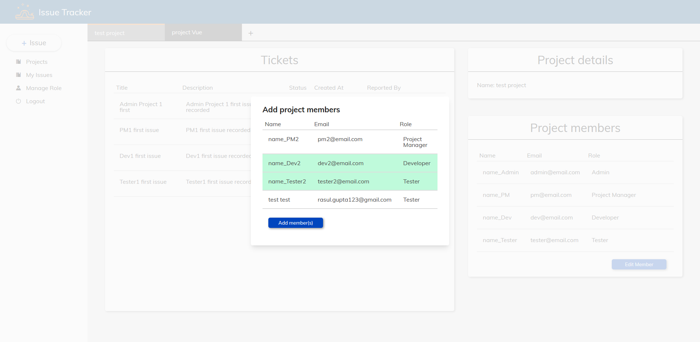

# issue-tracker
Issue tracker for software team. User can create new projects, add/remove member from a project, create issue/bug on the project and assign member to work on issues.

Rewrote v2 to follow principles layout in Clean Architecture. Learn to encapsulate entities, and create use cases for interfaces/controllers to call and act on.

## The stack
- **Server side**: Node with Express (ES2017 async/await), Typescript
- **Database**: MongoDB, mongoose
- **Client Side**: Vue, Vuex, Vue Router
- other tools: typescript compiler

## Live App
**View it on [here](https://leoltl-issue-tracker.herokuapp.com)**

You can create your own account or login in with one of the following accounts:

**Populated profiles

**Sample profiles**

|username|password|
|---|---|
|u_admin|aaaaaaaa|
|u_PM|aaaaaaaa|

## Features
**As authenticated user**:
- I can view the projects that I am a memeber of.
- I can create new project
- I can create new issue
- I can leave comment or change the issue status on an issue to give update
- I add/ remove member from project (based on role's permission)

**As authorized user**:
- I can modifiy the projects and issue based on my role's permission
- Admin can reassign a user's role
